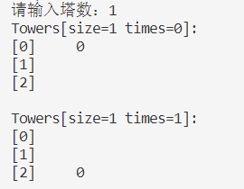
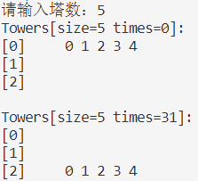
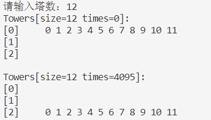

# Hannoi

## 项目介绍

用C++编写的超级简单的汉诺塔程序！

​																			**递归！**

​																 	  **recursion!**

## 使用说明

编译运行程序，终端会提示 **请输入塔数：**

你可以输入任何整数，从1~无穷都可以，按下回车后终端会用符号显示汉诺塔前后移动

你知道，汉诺塔问题复杂度是指数级的，当你输入的整数达到26左右时，你会发现运行速度明显变慢了

当然，你也可以输入诸如 "-8" , "4.7", "hello", "?" 等东西

## 效果

**输入1**

**输入5**

**输入12**

## 最后

我猜你已经开始学递归了>。<